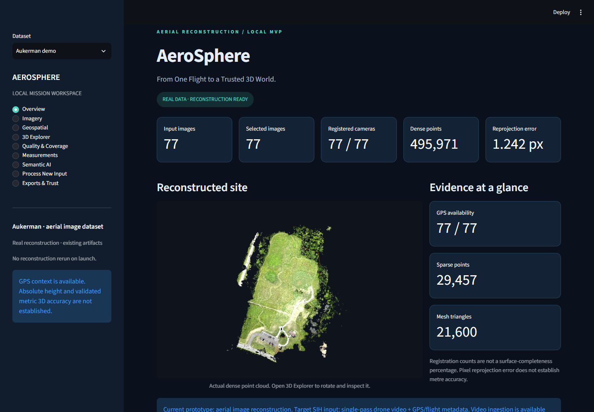
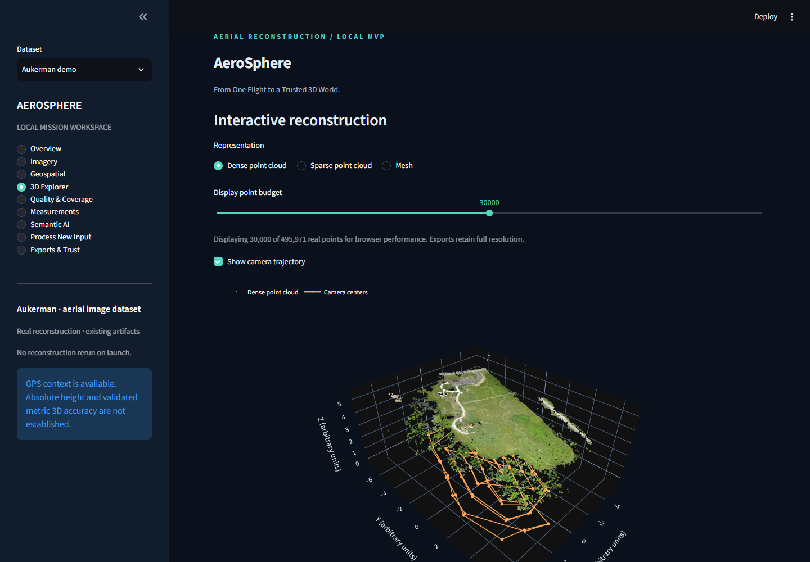
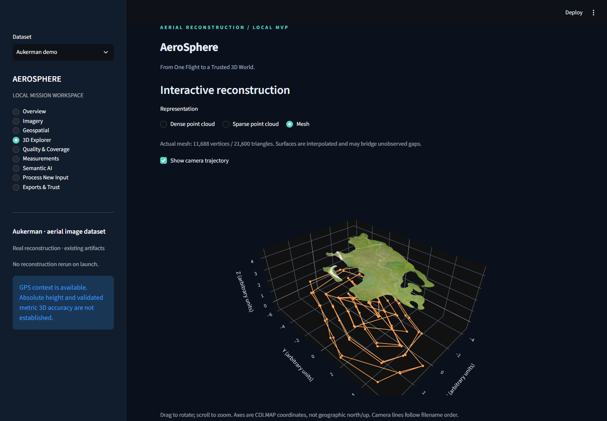
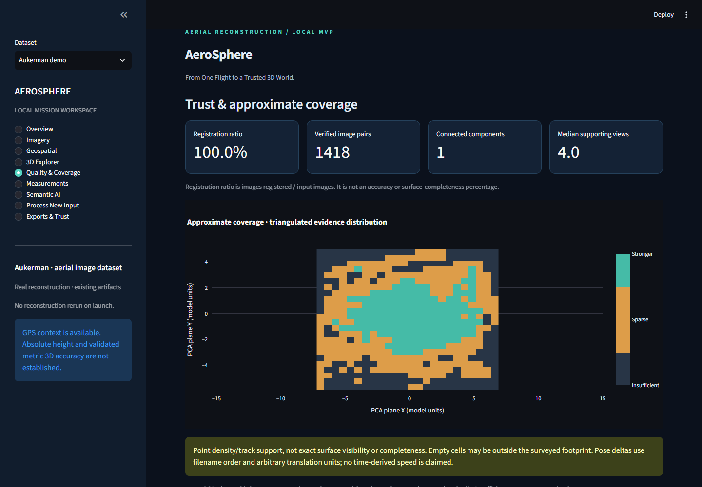

# 🛰️ AeroSphere

## AI-Powered Single-Pass Aerial 3D Reconstruction & Spatial Intelligence

> **From One Flight to a Trusted 3D World.**

## Overview

AeroSphere is a local prototype for turning constrained aerial capture into an inspectable 3D reconstruction. It connects image selection, established photogrammetry, geographic context and explicit quality limitations in a Streamlit dashboard. COLMAP supplies the reconstruction backbone; AeroSphere does not invent SfM or MVS.

**Current validation uses 77 aerial photographs, not a complete single-pass drone-video capture.** Video ingestion is implemented and separately tested; full aerial-video reconstruction validation remains future work.

## Problem statement

**SIH26158 — Single-Pass Drone Video to Accurate 3D Model Generation System**  
Sponsor: NTRO · Theme: Robotics & Drones · Category: Software

A single pass provides limited viewpoints. Blur, compression, lighting changes, moving objects, GPS uncertainty and occlusion complicate reconstruction and measurement. The prototype exposes these limitations instead of promising unseen surfaces or unsupported accuracy.

## Implemented workflow and architecture

```text
Aerial images / local video
    ↓
Metadata extraction / bounded video frame sampling
    ↓
Image quality analysis + conservative redundancy filtering
    ↓
COLMAP features → matching → camera estimation → sparse SfM
    ↓
Optional COLMAP stereo → dense cloud → Poisson mesh
    ↓
GPS context + evidence / coverage reports
    ↓
Streamlit inspection → measurements with explicit units → exports
```

| Stage | Current implementation |
|---|---|
| Input | EXIF camera/GPS extraction; sequential OpenCV video decoding with interval and frame limits, timestamps and partial/failure status |
| Image intelligence | Quality indicators and conservative duplicate filtering; preserves potentially useful viewpoints |
| Reconstruction | COLMAP SIFT extraction, exhaustive matching and incremental mapping; exports actual camera poses and sparse points |
| Dense geometry | After successful sparse reconstruction: undistortion, PatchMatch stereo, photometric fusion and Poisson meshing |
| Geographic context | GPS positions, camera trajectory and provisional horizontal camera-plane alignment to UTM |
| Quality | Reprojection error, registration statistics, verified match graph, track support and approximate evidence grid |
| Inspection | Input/selected image galleries; interactive sparse/dense/mesh views and camera trajectory |
| Measurement | Ellipsoidal horizontal distance between GPS camera positions in metres; sparse-point distance in arbitrary model units |
| Optional AI | Cached pretrained TorchVision SSDLite CPU object detection; no aerial-specific validation or 3D semantic projection |
| Jobs and exports | Isolated local input jobs, real status/logs, metadata CSV, native geometry PLY and JSON/Markdown reports |

The dashboard has nine pages: Overview, Imagery, Geospatial, 3D Explorer, Quality & Coverage, Measurements, Semantic AI, Process New Input, and Exports & Trust. Dense previews are sampled for browser performance; downloads retain full geometry. Demo views work offline once inputs, dependencies and optional weights are available.

## Technology stack

| Purpose | Used technologies |
|---|---|
| Runtime / image processing | Python 3.11, OpenCV, Pillow |
| Reconstruction / geometry | External COLMAP 4.2.0 CUDA, Open3D |
| Scientific computing | NumPy, SciPy, Pandas |
| Geospatial math | PyProj |
| Interface / plots | Streamlit, Plotly, Matplotlib |
| Optional semantic inference | PyTorch, TorchVision |

`requirements.txt` records the tested environment's direct Python dependencies. The current video code uses OpenCV; a separate FFmpeg executable is not invoked. COLMAP is installed separately. Optional Torch/TorchVision versions must be compatible with each other and the local hardware.

## Current prototype results

| Metric | Validated result |
|---|---:|
| Registered cameras | 77 / 77 |
| Sparse points | 29,457 |
| Dense points | 495,971 |
| Mesh triangles | 21,600 |
| Mean point reprojection error | 1.242 px |
| Automated tests | 9 / 9 passed on the prepared local dataset |

These results were obtained from the 77-image OpenDroneMap Aukerman aerial mapping dataset used to validate the reconstruction pipeline. They are not proof of complete SIH single-pass drone-video performance, centimetre accuracy or real-time processing. Reprojection error is an image-space consistency measure, not geographic accuracy. See [demo validation](DEMO_VALIDATION.md) and [reconstruction validation](RECONSTRUCTION_VALIDATION.md).

## Validation dataset

The [OpenDroneMap Aukerman dataset](https://github.com/OpenDroneMap/odm_data_aukerman) contains 77 aerial JPG images with GPS and raw altitude metadata. Its upstream repository identifies a CC0 license. The approximately 543 MB dataset is **not included** here; obtain images from the upstream `images/` directory and place the JPG files directly in `input/aukerman/`.

Raw altitude is present, but its reference and independent accuracy are not established. Full drone-video validation remains a next validation stage.

## Demo and screenshots

The dashboard currently runs locally during development at `http://127.0.0.1:8501`. This is not a public hosted demo. On the existing prepared machine, launch with:

```powershell
.\run_aerosphere.bat
```

These are actual screenshots from the working Aukerman demo, not generated mockups.






## Project structure

```text
AeroSphere/
├── app/                         Dashboard, geospatial math and extra pages
├── scripts/                     Processing, reconstruction, reports and tests
├── docs/screenshots/            Real demo screenshots
├── run_aerosphere.bat            Existing Windows launcher
├── run_aerosphere.py             Report preparation and Streamlit startup
├── requirements.txt
├── IMAGE_INTELLIGENCE.md
├── RECONSTRUCTION.md
├── RECONSTRUCTION_VALIDATION.md
├── DEMO_VALIDATION.md
└── README.md
```

Local runtime directories `input/`, `frames/`, `selected_frames/`, `metadata/`, `output/` and `results/` are excluded from Git. Scripts create their output directories. No environment, dataset, model weights or reconstruction is bundled.

## Windows setup for a fresh clone

**Existing working installations should keep their current environment and artifacts.** These instructions are for a new checkout; they have not been validated as a clean dependency installation on another machine.

The existing batch launcher expects `.venv` in the **parent** of the repository:

```powershell
mkdir AeroSphere-workspace
cd AeroSphere-workspace
git clone https://github.com/chandana-ux/AeroSphere.git AeroSphere
py -3.11 -m venv .venv
& .\.venv\Scripts\python.exe -m pip install -r .\AeroSphere\requirements.txt
cd AeroSphere
```

For reconstruction, use a compatible external Windows COLMAP 4.2.0 installation. The default location is `$HOME\Downloads\colmap-x64-windows-cuda\COLMAP.bat`; `--colmap` accepts a different launcher path. Dense stereo requires the appropriate CUDA-capable GPU/build. `--cpu` changes sparse feature extraction/matching, not dense stereo.

### Prepare the baseline on a fresh checkout

A source-only clone cannot launch the populated demo immediately. Obtain Aukerman separately and put its 77 JPG files in `input/aukerman/`, then run the existing stages below **only on the fresh checkout**:

```powershell
& ..\.venv\Scripts\python.exe scripts\extract_metadata.py
& ..\.venv\Scripts\python.exe scripts\analyze_images.py
& ..\.venv\Scripts\python.exe scripts\run_reconstruction.py --dense
.\run_aerosphere.bat
```

To override the COLMAP location, add `--colmap 'C:\path\to\COLMAP.bat'` to the reconstruction command. Omit `--dense` for a sparse-only run. Inspect stage logs on failure. Reconstruction may take substantial time and disk space; the published counts describe the existing validation run, not guaranteed identical output on all systems.

The launcher prepares lightweight reports from the generated `latest.json` pointers and starts Streamlit; it does not silently run reconstruction. Generated pointers contain local paths, so regenerate them on a new machine rather than copying stale pointers. Keep the terminal open; Ctrl+C stops the server. For a different port:

```powershell
& ..\.venv\Scripts\python.exe run_aerosphere.py --port 8502 --no-browser
```

### Process additional input

After preparing the baseline, use the dashboard's Process New Input page or:

```powershell
& ..\.venv\Scripts\python.exe scripts\pipeline.py --input 'C:\data\flight.mp4' --interval 2 --max-frames 100
```

A directory of images is also accepted. Add `--reconstruct` for sparse processing, and `--dense` for dense/mesh processing. Each job uses a separate `results/jobs/<UTC ID>/` directory. Completed reconstructions appear in the dataset selector after reload; frame-only jobs expose processing status. AVI/MJPEG and MP4 extraction were tested; other containers depend on the installed decoder. Video-derived frames do not acquire fabricated GPS.

Optional semantic inference requires compatible Torch/TorchVision. The explicit CLI option `scripts/semantic.py input/aukerman/DSC00229.JPG --allow-download` permits a one-time model download; the dashboard reuses cached weights. The tested example produced zero detections above 0.5. This is a valid model result, not proof of an empty scene.

## Outputs and testing

Outputs include native COLMAP models, sparse/dense/mesh PLY files, camera trajectory CSV, image/GPS metadata, quality/selection reports, approximate coverage and connectivity reports, geospatial assessment, and consolidated JSON/Markdown summaries. The dashboard also exports selected images and measurement results with explicit units. All generated outputs remain local and ignored by Git.

```powershell
& ..\.venv\Scripts\python.exe -m unittest discover -s scripts -p 'test*.py'
```

The full nine-test suite includes integration checks against the prepared Aukerman reconstruction and writes isolated synthetic test jobs. It is not a dataset-free clean-clone test suite. Tests cover video sampling/errors, metadata edge cases, conservative filtering, pose math, actual artifact counts, missing GPS and dashboard pages. The local browser demo was also checked with external requests blocked.

## Geographic interpretation and limitations

- Horizontal alignment fits a PCA camera plane to GPS-derived UTM coordinates assuming WGS84. It is provisional; full 3D georeferencing and independent metric accuracy are not established.
- Missing altitude-reference information prevents defensible absolute height measurement. RTK/PPK/GCP validation is not complete. No object dimensions in metres, surface areas or volumes are claimed.
- GPS measurements are horizontal distances between camera positions, not ground-object dimensions. Model-point measurements retain arbitrary reconstruction units.
- Observed means source imagery/metadata; inferred means estimated poses, points and mesh; unknown includes unseen surfaces and missing accuracy information. These are provenance categories, not per-surface confidence segmentation.
- Coverage is a 24×24 planar point-support grid, not exact visibility or scene completeness. Empty cells may lie outside the surveyed footprint. Poisson meshes may bridge unobserved gaps.
- Semantic detection is a basic generic pretrained prototype with uncalibrated scores. It is not aerial-specialized and has no validated 3D projection.
- Real-world single-pass drone-video reconstruction, moving-scene robustness and real-time edge performance have not been established.

## Why AeroSphere?

Existing tools already provide strong photogrammetry. AeroSphere focuses on the operational workflow around constrained aerial capture: selecting useful evidence, connecting geometry with geographic context, exposing quality and coverage, and inspecting reconstruction with honest measurement units. This is an integration focus, not a claim that competing tools lack these capabilities.

## Future work

Full aerial-video validation; timestamp-aligned flight telemetry; RTK/PPK/GCP metric validation; stronger aerial semantics; surface-level observed/inferred/unknown classification; improved visibility and next-best-view analysis; progressive reconstruction and edge performance evaluation.

## Research basis

- Schönberger and Frahm, **Structure-from-Motion Revisited**, CVPR 2016.
- Schönberger, Zheng, Pollefeys and Frahm, **Pixelwise View Selection for Unstructured Multi-View Stereo**, ECCV 2016.

Both are the reconstruction references cited by the [official COLMAP project](https://colmap.github.io/#citation). See its [tutorial](https://colmap.github.io/tutorial.html) for the underlying photogrammetry workflow. AeroSphere's UAV validation data comes from [OpenDroneMap Aukerman](https://github.com/OpenDroneMap/odm_data_aukerman). Gaussian splatting is not part of this implementation.

## Team

- Technical Development — [Name]
- Research — [Name]
- PPT / Product — [Name]
- Design — [Name]
- Presentation / Demo — [Name]
